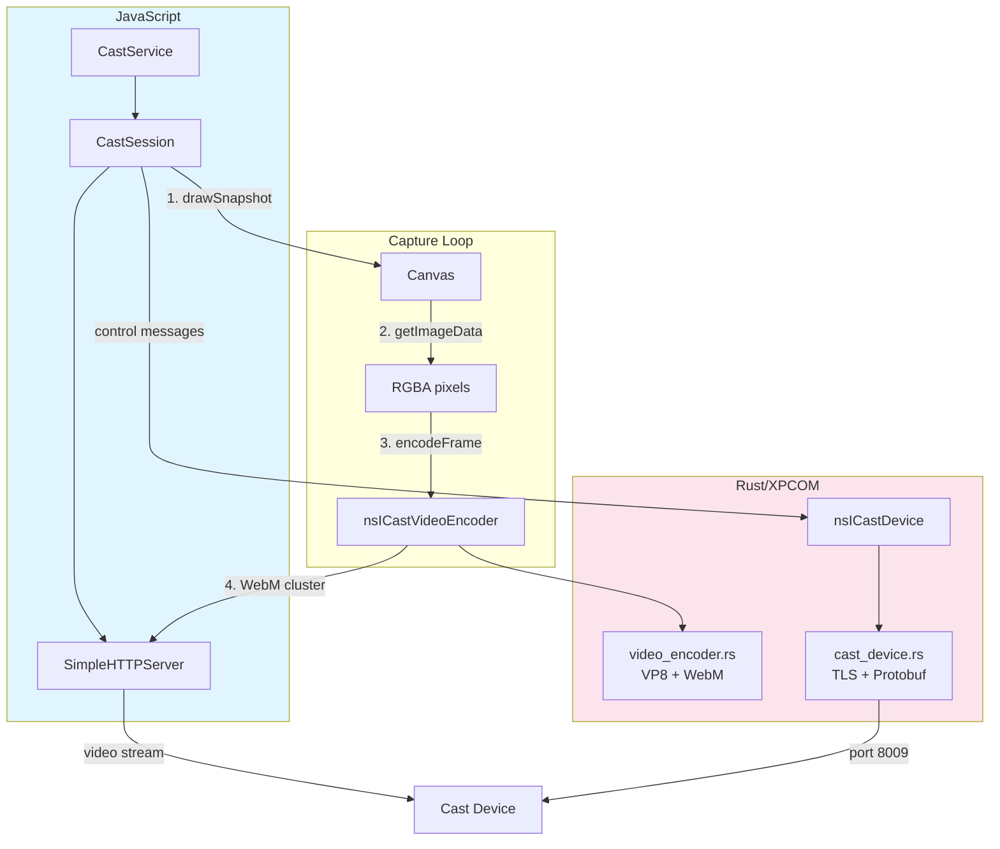
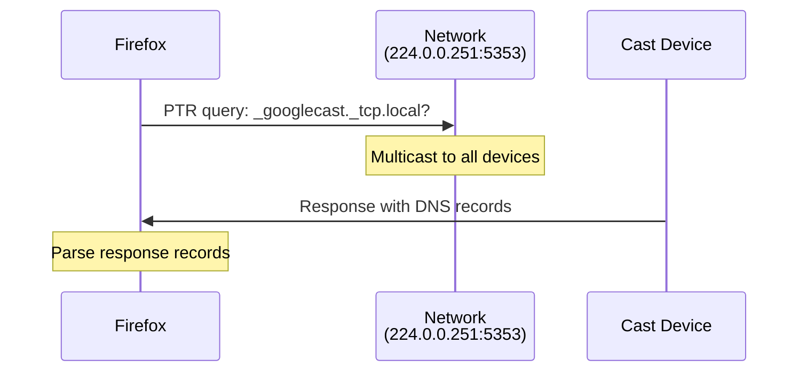
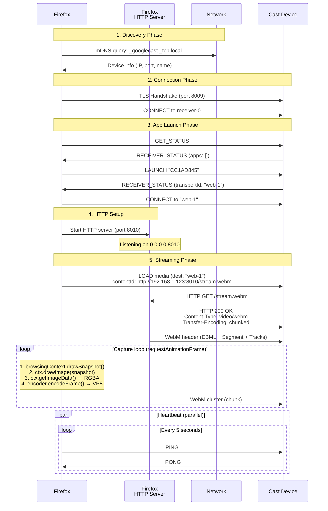
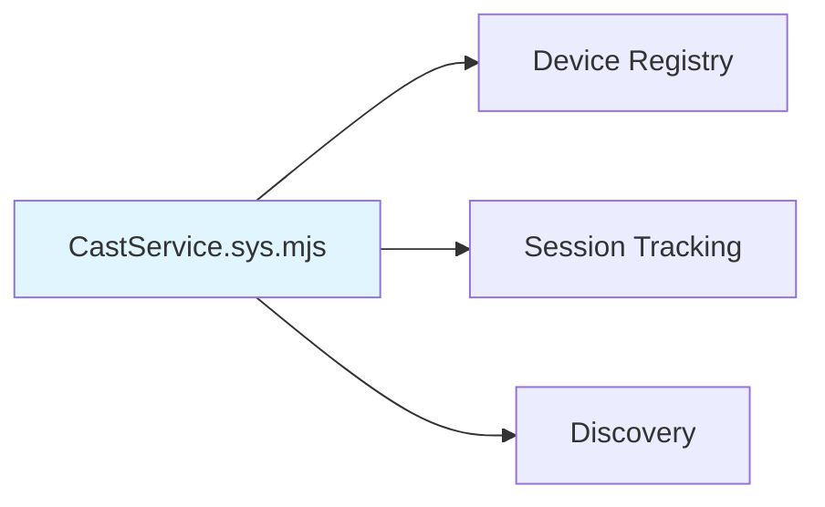
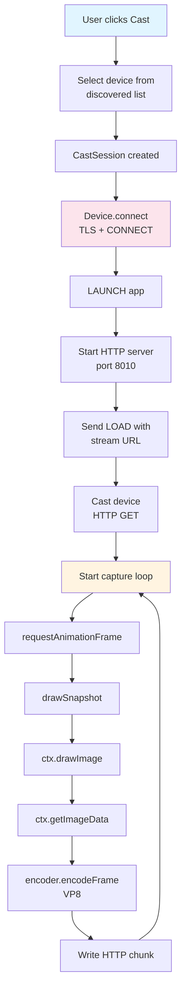
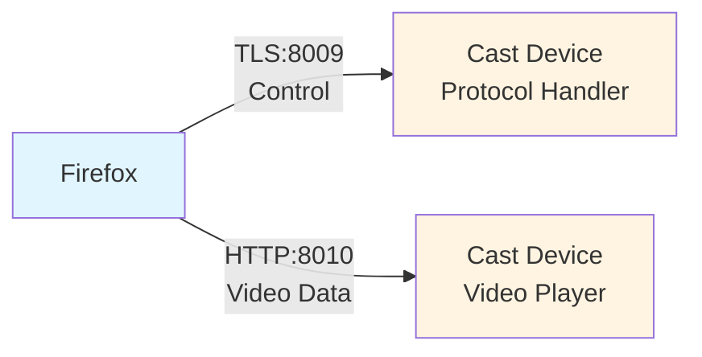
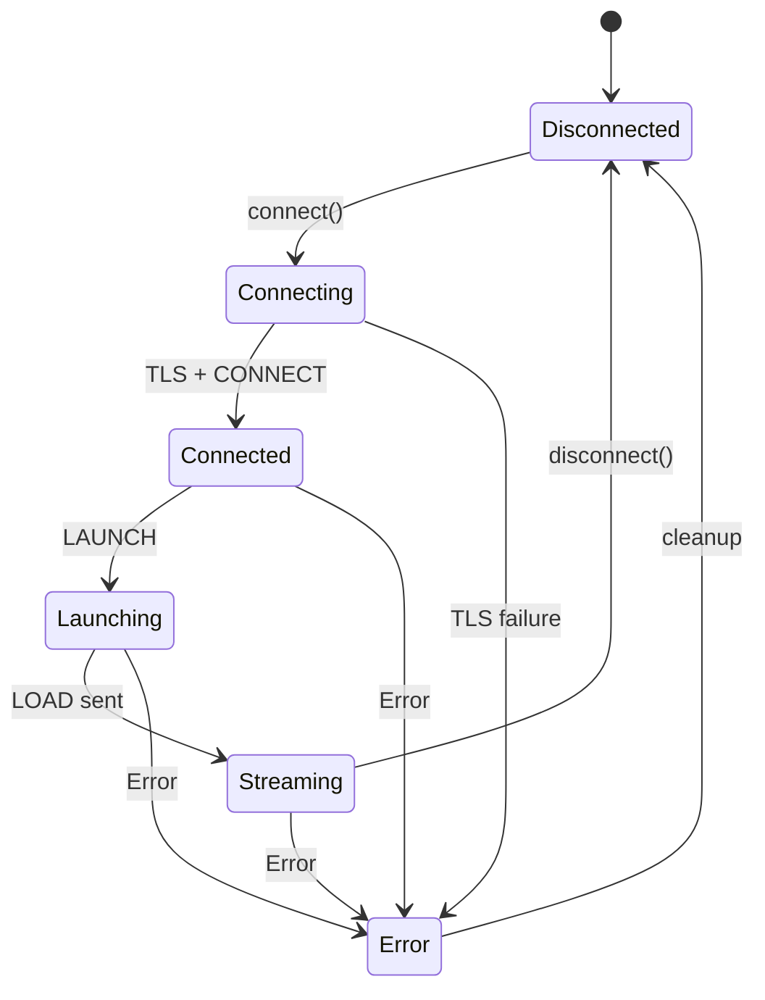

# Firefox Cast Implementation Guide

Technical reference for the Firefox Cast implementation.

---

## Overview

Firefox Cast streams browser tabs to Cast-enabled devices (Chromecast, Google TV, smart TVs) using:
- **Protocol**: Google Cast Protocol v2 over TLS
- **Video Codec**: VP8 (libvpx)
- **Container**: WebM
- **Architecture**: Rust (XPCOM) + JavaScript

### Components



**Core components:**
| Component | File | Role |
|-----------|------|------|
| Service | `CastService.sys.mjs` | Device registry, session lifecycle |
| Session | `CastSession.sys.mjs` | Capture loop orchestration |
| HTTP Server | `SimpleHTTPServer.sys.mjs` | Streams WebM to Cast device |
| Device | `cast_device.rs` | Cast protocol (TLS, Protobuf) |
| Encoder | `video_encoder.rs` | RGBA → VP8 → WebM |

---

## Device Discovery

### What is mDNS?

**mDNS (Multicast DNS)** enables devices to discover each other on a local network without a central DNS server. Unlike traditional DNS (which queries a server), mDNS broadcasts queries to all devices on the network, and devices respond directly.

| Property | Value |
|----------|-------|
| Multicast address | `224.0.0.251` |
| Port | `5353` |
| Protocol | UDP |

### DNS-SD (Service Discovery)

Cast devices advertise themselves using **DNS-SD** (DNS Service Discovery) with the service type:

```
_googlecast._tcp.local
```

| Part | Meaning |
|------|---------|
| `_googlecast` | Service name (Google Cast) |
| `_tcp` | Transport protocol |
| `local` | mDNS domain (local network) |

### Discovery Flow



**DNS records in response:**

| Record | Purpose | Example |
|--------|---------|---------|
| **PTR** | Points to device instance | `_googlecast._tcp.local` → `Living-Room._googlecast._tcp.local` |
| **SRV** | Hostname and port | → `Living-Room.local:8009` |
| **TXT** | Metadata (key=value) | `fn=Living Room TV`, `md=Chromecast` |
| **A** | IPv4 address | → `192.168.1.50` |

### Implementation

`CastDiscovery.sys.mjs` sends periodic mDNS queries (every 5 seconds) and parses responses:

```javascript
// Query packet structure
DNS Header (12 bytes)
  + Question: PTR for "_googlecast._tcp.local"
  + Type: 0x000C (PTR)
  + Class: 0x0001 (IN)

// Extracted device info
{
  name: "Living-Room._googlecast._tcp.local",
  host: "192.168.1.50",      // From A record
  port: 8009,                 // From SRV record
  friendlyName: "Living Room TV",  // From TXT "fn="
  model: "Chromecast"         // From TXT "md="
}
```

**Usage:**
```javascript
const discovery = new CastDiscovery();
discovery.addListener({
  onDeviceFound(device) { /* device appeared */ },
  onDeviceLost(name) { /* device disappeared */ }
});
await discovery.start();
```

---

## Cast Protocol

### Two-Channel Architecture

Cast uses separate channels for control and data:

| Channel | Port | Protocol | Purpose | Implementation |
|---------|------|----------|---------|----------------|
| **Control** | 8009 | TLS + Protobuf | Device commands, app lifecycle, media control | `cast_device.rs` |
| **Data** | 8010 | HTTP | Video stream (WebM chunks) | `SimpleHTTPServer.sys.mjs` |

### Control Channel Stack

| Layer | Description | Implementation |
|-------|-------------|----------------|
| **Application** | JSON messages in namespaces | JavaScript modules |
| **Protocol Buffer** | `[4-byte length][CastMessage]` | `message.rs` |
| **TLS** | Encrypted, self-signed cert | `nsISocketTransport` |
| **TCP** | Port 8009 | OS stack |

### Message Structure

```
Wire Format:
┌────────────────────────────────┐
│ [4 bytes: length (big-endian)] │
│ [N bytes: protobuf message]    │
└────────────────────────────────┘

CastMessage (protobuf):
- protocol_version: 0
- source_id: "sender-0"
- destination_id: "receiver-0" | transportId
- namespace: "urn:x-cast:..."
- payload_type: STRING (0)
- payload_utf8: JSON string
```

**Implementation:** `src/message.rs`

### Namespaces

| Namespace | Purpose | Messages |
|-----------|---------|----------|
| `urn:x-cast:com.google.cast.tp.connection` | Virtual connections | CONNECT, CLOSE |
| `urn:x-cast:com.google.cast.tp.heartbeat` | Keep-alive (5s interval) | PING, PONG |
| `urn:x-cast:com.google.cast.receiver` | App lifecycle | GET_STATUS, LAUNCH, STOP |
| `urn:x-cast:com.google.cast.media` | Media control | LOAD, PLAY, PAUSE, STOP |

**Note:** Media messages go to app's `transportId`, not `receiver-0`.

### Connection Sequence



**Critical:** Two CONNECT messages required (receiver + app transport).

---

## Architecture

### Layer 1: Service (JavaScript)



**API:**
- `addManualDevice(ip, port)` - Add device by IP
- `startTabCasting(deviceId, browser, window)` - Start casting
- `stopCasting()` - Stop all sessions

### Layer 2: JavaScript Modules

| Module | Purpose |
|--------|---------|
| `CastDevice.sys.mjs` | Promise wrapper around XPCOM device |
| `CastSession.sys.mjs` | Tab casting orchestration |
| `CastMediaHandler.sys.mjs` | Media namespace protocol |
| `CastMediaSession.sys.mjs` | Remote media casting (URL-based) |
| `CastDiscovery.sys.mjs` | mDNS device discovery |
| `SimpleHTTPServer.sys.mjs` | HTTP streaming server |
| `CastConstants.mjs` | Error codes, states, port constants |
| `CastError.mjs` | Custom error class |

### Layer 3: XPCOM Interface

```idl
// nsICastDevice.idl
interface nsICastDevice : nsISupports {
  void connect(in AUTF8String address, in long port);
  void disconnect();
  void sendMessage(in AUTF8String namespace, in AUTF8String payload);
  void sendMessageTo(in AUTF8String dest, in AUTF8String ns, in AUTF8String payload);
  attribute nsICastDeviceCallback callback;
  readonly attribute AUTF8String state;
  AUTF8String getAppTransportId();
  AUTF8String getAppSessionId();
};

// nsICastVideoEncoder.idl
interface nsICastVideoEncoder : nsISupports {
  void init(in unsigned long width, in unsigned long height,
            in unsigned long bitrate, in unsigned long fps);
  Array<octet> encodeFrame(in Array<octet> rgba, in boolean keyframe,
                           in long long timestampMs);
  Array<octet> getHeader();
  void shutdown();
  void dumpTestWebM(in unsigned long frames);  // Debug only
};
```

### Layer 4: Rust Implementation

**cast_device.rs**
- TLS connection via `nsISocketTransport`
- Protocol Buffer encoding/decoding (prost)
- Message framing (4-byte length prefix)
- Async message reception via `nsIStreamListener`

**video_encoder.rs**
- VP8 encoding via libvpx (`vpx_codec_vp8_cx()`)
- RGBA → YUV420 conversion
- WebM container muxing
- **Note:** Comments incorrectly say VP9; implementation uses VP8

**stream_listener.rs**
- Implements `nsIStreamListener` for async I/O
- Parses message frames, routes by namespace
- Invokes JavaScript callbacks

---

## Data Flow

### Tab Casting Pipeline



**Capture Loop:**
1. `requestAnimationFrame()` - Schedule next frame capture
2. `browsingContext.currentWindowGlobal.drawSnapshot()` - Capture browser content to ImageBitmap
3. `ctx.drawImage(snapshot)` - Draw snapshot to canvas
4. `ctx.getImageData()` - Extract RGBA pixel array
5. XPCOM boundary crossing
6. `video_encoder.rs::EncodeFrame()` - RGBA → YUV420 → VP8 → WebM cluster
7. Write cluster to HTTP response (chunked transfer)

### Two-Channel Design



**Rationale:** Separation of control and data planes. Cast devices have optimized HTTP video clients.

---

## Design Decisions

### Why Rust + XPCOM?

**XPCOM Approach:**
- Automatic memory management (refcounting)
- Built-in callback support
- Thread marshaling
- Firefox standard

**Alternative (FFI) Rejected:**
- Manual memory management
- No callback mechanism
- Would need wrappers anyway

### Why VP8?

| Codec | Encoding Speed | Compression | Device Support | License |
|-------|---------------|-------------|----------------|---------|
| H.264 | Fast | Good | Universal | Patented |
| VP8 | **Fast** | Good | **Wide** | **Royalty-free** |
| VP9 | Slow | Better | Good | Royalty-free |
| AV1 | Very Slow | Best | Limited | Royalty-free |

**Decision:** VP8 provides optimal encoding speed for real-time screen capture while remaining royalty-free.

### Why WebM?

- Designed for streaming (self-contained clusters)
- Works with VP8/VP9
- No duration metadata required (unlike MP4)
- Cast device native support

---

## State Management



**States:** `disconnected`, `connecting`, `connected`, `launching`, `streaming`, `error`

**Rust:** `state.rs::DeviceState` enum (source of truth)
**JavaScript:** Mirrored via `onStateChanged` callback

---

## Memory Management

### JavaScript → Rust

```javascript
const device = Cc["@mozilla.org/cast/device;1"]
  .createInstance(Ci.nsICastDevice);
// Strong reference (RefPtr)
// Automatic cleanup when GC collects
```

### Rust Side

```rust
#[xpcom::refcounted]
struct CastDevice {
    // Reference counted
    // Drop called when count reaches 0
}
```

XPCOM refcounting integrates with JavaScript GC. No manual memory management required.

---

## Challenges & Solutions

### Frame Synchronization

**Problem:** The Cast receiver buffers unpredictably. If Firefox encodes frames continuously, lag accumulates indefinitely because the receiver starts playback 3-5 seconds after the stream begins.

**Solution:** Track receiver playback position and skip frames when too far ahead.

```javascript
// CastSession.sys.mjs
const maxLagMs = 1000;
const timestampMs = Date.now() - this._streamStartTime;
const receiverTimeMs = this.getEstimatedReceiverTime() * 1000;
const lagMs = timestampMs - receiverTimeMs;

if (lagMs > maxLagMs) {
  this._droppedFrames++;
  return; // Skip frame
}
```

**Additional mitigations:**
- Pause capture entirely when receiver reports `BUFFERING` state
- Resync stream clock when playback first starts (if lag > 500ms)
- Drop frames when write buffer exceeds 60 pending frames

### Quality Loss at FFI Boundary

**Problem:** Video looked blurry despite high bitrate. The quality was being destroyed before encoding even started.

**Root causes:**
1. **Canvas interpolation** - Default `imageSmoothingQuality: "low"` used bilinear interpolation, causing blur when scaling browser content
2. **Color space mismatch** - RGBA → I420 conversion used incorrect coefficients, producing washed-out colors

**Solutions:**

Canvas scaling (JavaScript):
```javascript
this.ctx.imageSmoothingQuality = "high"; // Lanczos-like interpolation
```

Color conversion (Rust):
```rust
// BT.709 HD color space with limited range
let y_val = ((66 * r + 129 * g + 25 * b + 128) >> 8) + 16;
y_plane[y_idx] = y_val.clamp(16, 235) as u8;

// Initialize planes to prevent artifacts on first frame
for byte in y_plane.iter_mut() { *byte = 16; }   // Black
for byte in u_plane.iter_mut() { *byte = 128; }  // Neutral chroma
```

### Key Insights

**What it takes to make Cast work with Firefox:**

1. **Two-channel architecture is mandatory** - Cast devices expect control (TLS:8009) and data (HTTP) on separate channels. Attempting to stream video over the Cast protocol itself fails.

2. **Self-signed certificate handling** - Cast devices use self-signed TLS certificates. Firefox must call `addCertificateOverride()` before connecting, or the TLS handshake fails silently.

3. **Receiver app lifecycle is asynchronous** - The DefaultMediaReceiver app takes 3-5 seconds to launch. Encoding must not start until the app connects to the HTTP stream, or frames queue up causing permanent lag.

4. **WebM streaming requires special structure** - Each frame must be wrapped in a self-contained WebM cluster. The header (EBML + Segment + Tracks) must be sent first, before any frames.

5. **VP8/VP9 require even dimensions** - Chroma subsampling requires width and height to be even. Canvas dimensions are forced even: `width & ~1`.

6. **Message routing is destination-specific** - Media commands must go to the app's `transportId` (e.g., `web-1`), not `receiver-0`. Sending to the wrong destination silently fails.

---

## Common Issues

### Two CONNECT Messages Required

```
❌ WRONG: TLS → CONNECT receiver-0 → LAUNCH → LOAD web-1 (fails)
✓ CORRECT: TLS → CONNECT receiver-0 → LAUNCH → CONNECT web-1 → LOAD web-1
```

### Wrong Destination

```javascript
// ❌ Wrong: sends to receiver-0
device.sendMessage("urn:x-cast:...media", msg)

// ✓ Correct: sends to app transport
const tid = device.getAppTransportId();
device.sendMessageTo(tid, "urn:x-cast:...media", msg)
```

### WebM Header Required

```
❌ WRONG: HTTP connect → frame 1 → frame 2 (no header)
✓ CORRECT: HTTP connect → WebM header → frame 1 → frame 2
```

Use `encoder.getHeader()` before `encodeFrame()`.

### Certificate Trust

Cast devices use self-signed certificates. `CastDevice.sys.mjs` automatically calls `addCertificateOverride()` when connecting to discovered devices. For manual connections, ensure the certificate is trusted before `connect()`.

---

## Development

### Build

```bash
# Full build
./mach build

# Rust changes only
./mach build browser/components/cast

# IDL changes (requires full rebuild)
./mach build
```

### Testing

```bash
# Run tests
./mach test browser/components/cast/test/

# With logging
MOZ_LOG=cast:5 ./mach run

# Generate test WebM
const enc = Cc["@mozilla.org/cast/video-encoder;1"].createInstance(Ci.nsICastVideoEncoder);
enc.init(1280, 720, 2000000, 30);
enc.dumpTestWebM(300); // → /tmp/test_output.webm
```

### Adding XPCOM Methods

1. Update IDL: `nsICastDevice.idl`
2. Implement in Rust: `cast_device.rs`
3. Rebuild: `./mach build`

### Key Files

```
browser/components/cast/
├── CastService.sys.mjs              # Service layer (singleton)
├── content/
│   ├── browser-cast.js              # Browser UI integration
│   └── castPanel.inc.xhtml          # Cast panel markup
├── modules/
│   ├── CastDevice.sys.mjs           # XPCOM device wrapper
│   ├── CastSession.sys.mjs          # Tab casting orchestration
│   ├── CastMediaSession.sys.mjs     # URL-based media casting
│   ├── CastMediaHandler.sys.mjs     # Media namespace protocol
│   ├── CastDiscovery.sys.mjs        # mDNS discovery
│   ├── SimpleHTTPServer.sys.mjs     # HTTP streaming
│   ├── CastConstants.mjs            # Constants, error codes
│   └── CastError.mjs                # Error class
├── src/
│   ├── lib.rs                       # Crate root
│   ├── cast_device.rs               # XPCOM device implementation
│   ├── video_encoder.rs             # VP8 encoding
│   ├── stream_listener.rs           # Async message receiver
│   ├── message.rs                   # CastMessage protobuf
│   ├── messages.rs                  # JSON message type definitions
│   ├── state.rs                     # DeviceState enum
│   ├── constants.rs                 # Rust constants
│   ├── vpx_ffi.rs                   # libvpx bindings
│   ├── webm_writer_ffi.rs           # WebM muxer bindings
│   └── handlers/
│       ├── mod.rs
│       ├── connection.rs            # CONNECT/CLOSE
│       ├── heartbeat.rs             # PING/PONG
│       └── receiver.rs              # GET_STATUS/LAUNCH
├── nsICastDevice.idl                # Device interface
├── nsICastVideoEncoder.idl          # Encoder interface
├── cast_device.h                    # C++ header for Rust FFI
├── cast_video_encoder.h             # C++ header for encoder FFI
├── Cargo.toml                       # Rust crate manifest
├── moz.build                        # Mozilla build system
├── components.conf                  # XPCOM component registration
└── notes/                           # Additional documentation
```

---

## Future Work

### P0: Required for Ship

| Item | Description | Complexity |
|------|-------------|------------|
| **Testing infrastructure** | Mochitest/xpcshell tests, mock Cast device for CI, integration tests | High |
| **Adaptive bitrate** | Adjust bitrate based on network conditions and receiver feedback | Medium |
| **Audio support** | Add Opus audio encoding, mux audio+video in WebM | High |
| **Permissions model** | User consent for casting, indicator when casting active | Medium |

### P1: High Value

| Item | Description | Complexity |
|------|-------------|------------|
| **Media element casting** | Detect `<video>` elements and cast directly (like Picture-in-Picture) without tab capture overhead | High |
| **Hardware encoding** | Use VideoToolbox (macOS) / MediaFoundation (Windows) for VP8/H.264 | High |
| **Error recovery** | Automatic reconnection on network interruption, graceful degradation | Medium |
| **User preferences** | Settings for resolution, bitrate, frame rate (`browser.cast.*` prefs) | Low |

### P2: Nice to Have

| Item | Description | Complexity |
|------|-------------|------------|
| **Cast Streaming Protocol** | RTP/UDP streaming with Chrome Mirroring app for <500ms latency | Very High |
| **VP9 codec** | 30-50% better compression than VP8, but slower encoding | Medium |
| **Multi-device** | Cast to multiple devices simultaneously | Medium |
| **Chromecast Ultra** | 4K support, HDR passthrough | Medium |

### Technical Debt

- Fix VP9 comments in code (implementation uses VP8)
- Add telemetry for cast sessions (duration, errors, quality metrics)
- Consolidate error handling across modules

---

## References

**In this directory:**
- `ARCHITECTURE.md` - High-level architecture overview
- `notes/CAST_PROTOCOL.md` - Detailed Cast protocol documentation
- `notes/STREAMING_FLOW.md` - End-to-end streaming flow
- `notes/VIDEO_ENCODING_CONCEPTS.md` - VP8/WebM encoding details

**Mozilla tools:**
- `./mach build` - Build the project
- `./mach test browser/components/cast/` - Run tests
- `MOZ_LOG=cast:5 ./mach run` - Run with Cast logging
